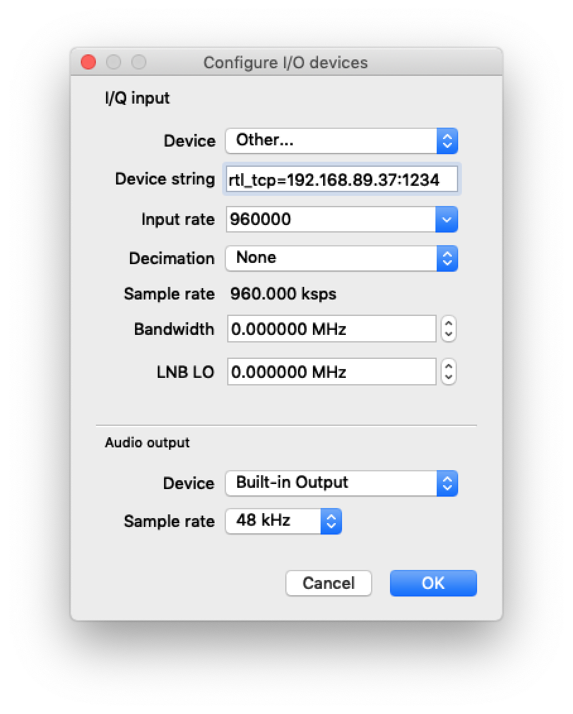
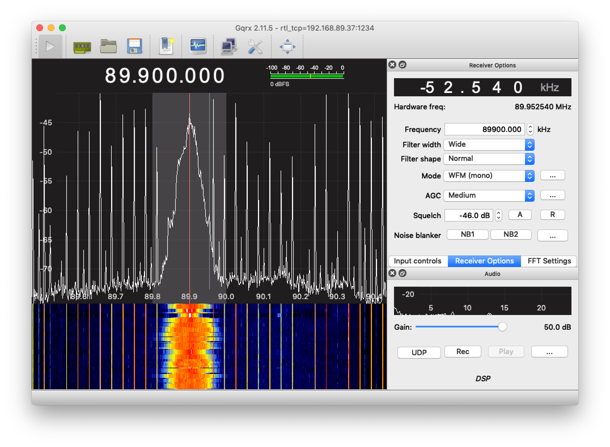

# GQRX Raspberry pi 3 and docker

Requirements:

- Raspberry pi with docker daemon
- RLT_SDR USB Device connected to the raspberry pi
- GQRX over the network

## 1 Docker container

```
docker run -d -p 1234:1234 --privileged -v /dev/bus/usb:/dev/bus/usb albertsola/rpi3-rtl_tcp:latest
```

## 2 GQRX Setup

Device `rtl_tcp={raspberry_ip}:1234`

Note: If you have an inestable wifi, lower the input rate





